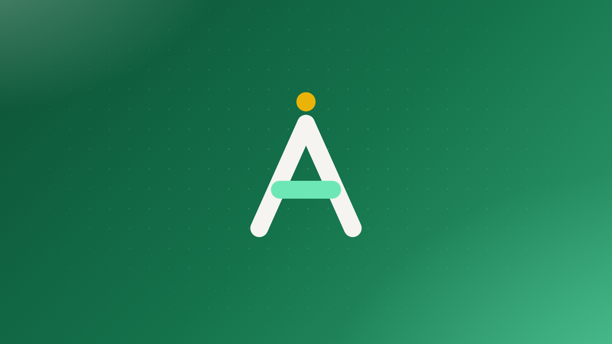

This post is a reference you can read side by side with its own source file, `blog/everything-in-a-post.md`. Everything below is plain Markdown: no imports, no components to wire up. The fancier parts (the hero image up top, the table of contents, reading time, share links) come from frontmatter or appear entirely on their own.

## The frontmatter

Every post starts with a small frontmatter block:

```yaml
---
title: Everything you can put in a post
description: A working tour of every element a blog post can use.
heroImage: "./images/everything-in-a-post.png"
pubDate: 2026-07-23
tags: ["guide", "markdown"]
---
```

`heroImage` is optional: point it at a file next to your post and it renders at the top of the page and as the thumbnail in the blog listing, optimized by Astro at build time. `tags` power the tag pages, and the first one doubles as the category label on the listing. `updatedDate` is also available if you revise a post later.

## Text, links, and emphasis

Regular paragraphs support **bold**, *italic*, ***both at once***, ~~strikethrough~~, and `inline code`. Links can be [external](https://docs.astro.build), or relative to another post, like this one about [how this went from a template to a framework](../from-template-to-framework/).

> Blockquotes look like this. They're good for pulling a sentence out of its paragraph and making it feel important.

## Code blocks

Fenced code blocks get syntax highlighting via Shiki, a copy button, and a background that follows whichever of the 42 themes the reader picked:

```ts
import { defineCollection, z } from "astro:content";
import { glob } from "astro/loaders";

const blog = defineCollection({
	loader: glob({ base: "./blog", pattern: "**/*.md" }),
	schema: ({ image }) =>
		z.object({
			title: z.string(),
			description: z.string(),
			pubDate: z.coerce.date(),
			heroImage: z.union([image(), z.string()]).optional(),
			tags: z.array(z.string()).optional(),
		}),
});
```

Shell sessions work too, and are often clearer than prose:

```bash
npm create almanac@latest my-docs
cd my-docs && npm run dev
```

## Lists of every kind

Unordered, with nesting:

- Docs live in `docs/`
- Blog posts live in `blog/`
  - Hero images sit next to them in `blog/images/`
  - So relative paths stay short
- Hero images sit beside their post

Ordered, when sequence matters:

1. Write the post
2. Add it to no config file whatsoever, unless you want a custom sidebar order
3. It's already on the listing page

And task lists, for checklist-shaped posts:

- [x] Headings and text styles
- [x] Code blocks with copy buttons
- [x] Tables
- [ ] Run Python blocks as well as JavaScript

## Tables

| Element | Source | Styled by |
| --- | --- | --- |
| Headings | Markdown | `global.css` prose rules |
| Code blocks | Shiki | theme tokens (`--code-bg`) |
| Hero image | frontmatter | `BlogPost.astro` |
| Table of contents | your headings | scroll-spy script |

## Images

Any image in Markdown gets the same treatment. Drop the file next to the post and reference it relatively:



## What shows up without being asked

A few things on this page aren't in the Markdown at all:

- **Table of contents**: built from the headings above, with scroll-spy highlighting, in the sidebar on wide screens and a collapsible panel on small ones
- **Reading time**: computed from the word count at build time
- **Share links, related posts, and previous/next navigation**: all at the bottom of every post
- **RSS**: this post is already in the feed at `/rss.xml`

---

That's the whole vocabulary. If you want something this page doesn't have, the renderer is `packages/almanac/src/layouts/BlogPost.astro` and the styles are in `packages/almanac/src/styles/global.css`.
